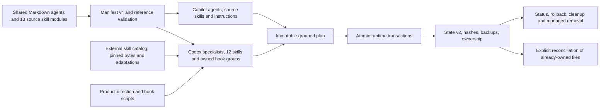

# Agent Forge Architecture

## System context

Agent Forge is a local customization compiler and transaction manager for Copilot and Codex. Shared Markdown sources remain separate from client-specific configuration. Rendering creates Copilot Markdown artifacts, Codex TOML agents, skills and native hook groups without modifying the original source files or cached upstream bytes.

The current manifest v4 defines 24 canonical agents and 13 source skill modules for Copilot. Codex selects 16 specialists and receives 12 skills: five bundles, one skill through which the primary conversation agent directs product development, and six external skills with pinned sources. The counts describe the current design; validation checks identities, references and ownership rather than requiring exactly 16 Codex agents or five bundles.

## Runtime boundaries

VS Code Copilot discovers Agent Forge only from the managed user profile:

- `~/.copilot/agents`
- `~/.copilot/skills`
- `~/.copilot/instructions`
- optional `~/.copilot/hooks`

Codex discovers Agent Forge from:

- `~/.codex/agents/*.toml`
- `~/.agents/skills/agent-forge-*`
- Agent Forge-owned event groups in `~/.codex/hooks.json`

The repository does not advertise local discovery overrides and never creates project `.codex/agents` or `.agents/skills` copies. Cross-runtime ID equality is intentional; duplicate IDs within one runtime are errors.

Codex `config.toml`, global `AGENTS.md`, personal `.codex/skills`, model choice, MCP configuration, sandbox approvals, and permissions remain user-owned.

The primary Codex conversation agent owns technical direction, specialist selection, integration, verification and product delivery through `agent-forge-build-software-products`. The selected `principal-engineer` is a bounded implementation and integration specialist. No specialist delegates to another specialist. Ordinary questions and independent research do not activate product-session hooks. The [complete agent matrix](codex-product-agents.md) defines the responsibilities and evidence expected from the current selection.

## Package boundaries

### Core

`packages/core` owns:

- contract and diagnostics: `types.ts`, `manifest.ts`, `validation.ts`, `diagnostics.ts`
- runtime discovery: `environment.ts`, `codex.ts`
- rendering: `renderVsCode.ts`, `renderCodex.ts`, `skillBundles.ts`, `externalSkills.ts`, `productDevelopment.ts`
- planning: `deploymentPlan.ts`, `cleanup.ts`
- ownership: `state.ts`, `transaction.ts`, `status.ts`, `restore.ts`, `wipe.ts`, `sharedHooks.ts`, `reconciliation.ts`
- VS Code policy: `capabilities.ts`, `models.ts`, `mcp.ts`

Every public operation returns structured data. CLI text, CLI JSON, extension UI, and tests consume the same results.

### CLI and extension

The CLI persists immutable plans and requires exact ID confirmation for profile mutation. The extension keeps the plan in memory and on disk, requires the same typed confirmation, detects `openai.chatgpt`, and presents runtime-separated readiness and ownership.

PowerShell scripts invoke the CLI. They contain no renderer, raw copier, broad delete, model downloader or MCP secret writer. The external-skill preparation script calls the shared core resolver; it does not maintain another implementation of downloading, integrity verification or adaptation.

## Rendering

Copilot rendering overlays exact available tools and optional validated model IDs while retaining the canonical source roles and the existing visibility and delegation graph.

Codex rendering:

1. selects the agent IDs declared in the manifest;
2. reads canonical agent name, description, and body;
3. rewrites source `$skill-id` references to their declared `$agent-forge-*` bundles;
4. adds the assigned product responsibility, evidence requirements, relevant external skills and prohibition on specialist delegation, while preserving the primary conversation agent's direction;
5. serializes only `name`, `description`, `developer_instructions`, and `sandbox_mode` through `smol-toml`;
6. parses the rendered TOML again before planning.

Bundle rendering strips component frontmatter, creates a concise `SKILL.md`, flattens component references one level under `references/`, rewrites links, and rejects unresolved skill references.

External-skill resolution validates the skills.sh origin, immutable GitHub revision, file paths, hashes, included license and agent assignments. Original resources are read from the ignored cache; explicit preparation may download only the pinned bytes. Each exact adaptation must match once, after which the resolver emits the adapted entrypoint, resources and `SOURCE.json`. The current catalog contains 140 original resources and 67 adaptations. The [selection report](../audits/codex-skill-selection.md) records the evidence and limits of that review. The immutable plan captures the resolved bytes, so apply does not download newer instructions.

Product-direction rendering includes the maintained session and hook scripts, and generates the responsibility reference and role configuration from the selected agents and skills. Each selected type receives exact `SubagentStart` and `SubagentStop` matchers; the configuration also includes primary `Stop`, `Interrupt` and `SessionEnd` events. Read-only roles return their evidence to the primary conversation agent for registration. Session storage is temporary and separate from profile installation and deployment state. Hooks may request one evidence-accounting continuation, honor interruption, close the active assignment and allow a turn to finish when hook validation or storage fails. They do not evaluate correctness or authorize additional work.

## Transaction and state

State schema v2 records independent active deployment IDs for `vscode` and `codex`. A safe v1 ledger migrates only when every owned path is under `.copilot`; the original ledger is backed up before v2 is written.

The manifest loader accepts v3 for existing deployments and v4 for product direction and external catalogs. New v4 fields are rejected under v3 instead of being silently interpreted. This manifest compatibility is independent of state-ledger migration.

An immutable plan records runtime, source commit, source and target paths, exact hashes, rendered bytes, diagnostics, and stale managed cleanup actions. Apply does not regenerate it.

Grouped deployment preflights every selected target, blocks unmanaged collisions and modified managed files, backs up touched paths and restores the selected runtimes if a grouped transaction fails. Stale complete files are removed only when their current hash matches the ledger. Rollback and managed removal preserve modified or unmanaged complete files.

Codex `hooks.json` uses ownership per event group rather than ownership of the entire document. Preview preserves foreign groups and top-level settings, records owned group fingerprints and captures the existing file hash. Apply rechecks that exact preimage and reconstructs the expected group replacement from prior ownership. Status checks owned group integrity independently of unrelated additions. Rollback, cleanup and removal replace or remove only verified owned groups; modified, missing or duplicated groups are conflicts. The file is removed only if Agent Forge created it and no foreign content remains. JSON formatting may change when the preserved document is serialized.

Explicit reconciliation handles existing complete files that were modified or removed after their managed deployment. It snapshots every path of the selected active runtime, persists current bytes and absences plus the prior ledger, verifies that neither files nor ledger changed after preview, and records that observed state as a new managed baseline. Applying reconciliation changes only the ledger, not installed file contents, and does not adopt unmanaged paths. The next deployment can then back up and recover that reviewed baseline. Reconciliation recovery restores the prior ledger only while the expected baseline and observations still match; later deployments must first be rolled back. Shared hook groups are excluded and retain their dedicated ownership procedure.

## Security and approval

Prompt restrictions are not an authorization boundary. Provider OAuth/scopes, Codex sandbox/approval policy, VS Code trust, and explicit user confirmation remain authoritative.

- Software Architect and Cybersecurity Engineer are Codex read-only.
- Other Codex specialists are workspace-write and inherit parent policy.
- Codex specialists do not delegate; the primary conversation agent coordinates the authorized product assignment.
- Cuando una acción de nube, producción, publicación remota, lanzamiento, descarga, control de un servicio o eliminación tenga efectos externos, el asistente debe comprobar que la autorización vigente cubre esa acción y su destino, y respetar los permisos y las políticas de la plataforma. Debe solicitar aprobación sólo cuando falte una autorización requerida para la acción concreta; no debe tratar una autorización suficiente ya vigente como si hubiera caducado por avanzar al siguiente paso.
- Agent Forge never edits Codex MCP configuration or stores secret values.
- Client hook trust remains separate from installing `hooks.json`. Agent Forge does not approve its own hooks or alter trust or permissions to make them execute.

## Release gates

Release retains the applicable build, package, extension-host, integration and recovery requirements. Evaluation coverage must match the agents and skills declared by the selected manifest: currently 24 canonical agents and 13 source skill modules for Copilot, and 16 agents and 12 discoverable skills for Codex. The existing lifecycle and failure scenarios remain required, including the six Codex lifecycle scenarios. Adding product direction and hooks adds relevant checks; it does not replace the earlier requirements or impose every release check on every routine change.

The acceptance checks for this redesign include complete generation and references; reproducible external-skill resolution; missing tools and inactive triggers; evidence from writing and read-only specialists; concurrency, failures, bounded continuation and cancellation; preservation of foreign hook groups; installation and recovery from interrupted operations; and a small product with interface, API and persistence. Strict validation for both runtimes, an immutable live preview, unchanged global `AGENTS.md`, zero unmanaged cleanup actions, applied-plan hash equivalence and accurate runtime status remain required for delivery.

Tests that count YAML fixtures and inspect required fields establish structural coverage only. A script test establishes the behavior exercised with its actual inputs. Neither proves that a model selected the right skill, that a product meets its requirements or that Desktop and the VS Code extension executed the hooks. The redesign still requires separately observed runs in fresh sessions of both clients, with versions, configuration, prompts, outcomes and limitations recorded. Those client checks remain pending until that evidence is collected; documentation or fixture presence cannot mark them complete.
