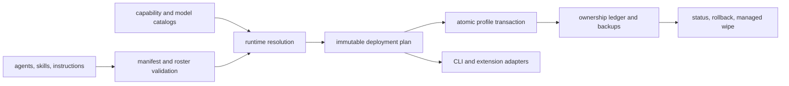

# Agent Forge Architecture

## System context

Agent Forge is a local VS Code customization compiler and transaction manager. Markdown files are canonical; runtime-specific tool/model overlays are applied only to rendered deployment copies.

## Package boundaries

### `packages/core`

Owns manifest parsing, diagnostics, VS Code discovery, roster validation, capability/model resolution, rendering, deployment planning, transactions, state, status, rollback, wipe, MCP setup planning, and scaffolding. Public lifecycle operations return structured results.

Key files:

- `types.ts`, `manifest.ts`, `validation.ts`, `diagnostics.ts`
- `environment.ts`, `capabilities.ts`, `models.ts`, `mcp.ts`
- `render.ts`, `deploymentPlan.ts`
- `transaction.ts`, `state.ts`, `deploy.ts`, `restore.ts`, `status.ts`, `wipe.ts`
- `paths.ts`, `hash.ts`, `errors.ts`, `scaffold.ts`, `index.ts`

### `packages/cli`

Commander adapter for validate, doctor, preview, deploy, status, rollback, deprecated restore, managed wipe, and MCP setup. Tool/model inventories come from explicit environment variables. It owns presentation and interactive confirmation, not business rules.

### `packages/extension`

VS Code adapter with dashboard, managed roster tree, Problems diagnostics, local Language Model API discovery, and explicit mutation dialogs. Services are thin wrappers around core.

## Identity and orchestration

The manifest preserves 24 IDs. Nine entries are user-visible. Creative Director invokes only Graphic Designer and UX Engineer. Principal Engineer invokes named implementation, verification, security, documentation, and knowledge workers. Workers cannot invoke agents. CTO and phase coordinators transition through `send: false` handoffs, so nested subagents are unnecessary.

## Rendering

Source prompts contain safe standard built-ins and role contracts. Rendering replaces the source `tools`, visibility, allowed-agent, and optional model fields for the deployed copy. Source files are read-only. Skill directories are expanded file by file and every rendered file is hashed.

## Transaction and state

1. Render and validate before profile mutation.
2. Reject unmanaged target collisions (`AF009`).
3. Back up a replaced managed target under `~/.agent-forge/deployments/<id>`.
4. Write a sibling temporary file and rename atomically.
5. On failure, reverse touched files and report `AF012`.
6. Persist the active deployment and complete artifact hashes.

Rollback and wipe compare current hashes with ledger hashes. User-modified files are preserved.

## Capability security

Catalog capabilities are logical policy. Runtime resolution intersects each capability's exact candidates with the discovered inventory. External provider authorization remains the actual security boundary. Operations Admin includes powerful tools but DevOps is user-selected or reached by a visible handoff and still requires approval for production/cloud/destructive mutations.

## Diagnostics

`AF001`–`AF012` cover frontmatter, identity, references, tools, skills, instructions, delegation, self-modification, collisions, VS Code support, models, and state integrity. Core results are authoritative; adapters format or publish them.

## Release gates

`npm run build`, `npm test`, extension TypeScript checking, strict roster validation, full readiness, immutable preview, and VS Code customization diagnostics must all pass before broad deployment. Preview hooks and VS Code customization evaluations are additional signals only.
