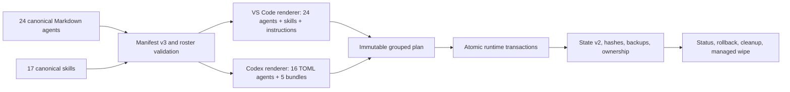

# Agent Forge Architecture

## System context

Agent Forge is a local dual-runtime customization compiler and transaction manager. Canonical Markdown remains runtime-independent. Rendering creates Copilot Markdown artifacts and Codex TOML/bundled skills without modifying source files.

## Runtime boundaries

VS Code Copilot discovers Agent Forge only from the managed user profile:

- `~/.copilot/agents`
- `~/.copilot/skills`
- `~/.copilot/instructions`
- optional `~/.copilot/hooks`

Codex discovers Agent Forge from:

- `~/.codex/agents/*.toml`
- `~/.agents/skills/agent-forge-*`

The repository does not advertise local discovery overrides and never creates project `.codex/agents` or `.agents/skills` copies. Cross-runtime ID equality is intentional; duplicate IDs within one runtime are errors.

Codex `config.toml`, global `AGENTS.md`, personal `.codex/skills`, model choice, MCP configuration, sandbox approvals, and permissions remain user-owned.

## Package boundaries

### Core

`packages/core` owns:

- contract and diagnostics: `types.ts`, `manifest.ts`, `validation.ts`, `diagnostics.ts`
- runtime discovery: `environment.ts`, `codex.ts`
- rendering: `renderVsCode.ts`, `renderCodex.ts`, `skillBundles.ts`
- planning: `deploymentPlan.ts`, `cleanup.ts`
- ownership: `state.ts`, `transaction.ts`, `status.ts`, `restore.ts`, `wipe.ts`
- VS Code policy: `capabilities.ts`, `models.ts`, `mcp.ts`

Every public operation returns structured data. CLI text, CLI JSON, extension UI, and tests consume the same results.

### CLI and extension

The CLI persists immutable plans and requires exact ID confirmation for profile mutation. The extension keeps the plan in memory and on disk, requires the same typed confirmation, detects `openai.chatgpt`, and presents runtime-separated readiness and ownership.

PowerShell scripts invoke the CLI. They contain no renderer, raw copier, broad delete, model downloader, or MCP secret writer.

## Rendering

Copilot rendering overlays exact available tools and optional validated model IDs while retaining the 24 source roles.

Codex rendering:

1. selects 16 IDs from manifest v3;
2. reads canonical agent name, description, and body;
3. rewrites `$skill-id` references to one of five `$agent-forge-*` bundles;
4. prepends an authoritative no-delegation overlay;
5. serializes only `name`, `description`, `developer_instructions`, and `sandbox_mode` through `smol-toml`;
6. parses the rendered TOML again before planning.

Bundle rendering strips component frontmatter, creates a concise `SKILL.md`, flattens component references one level under `references/`, rewrites links, and rejects unresolved skill references.

## Transaction and state

State schema v2 records independent active deployment IDs for `vscode` and `codex`. A safe v1 ledger migrates only when every owned path is under `.copilot`; the original ledger is backed up before v2 is written.

An immutable plan records runtime, source commit, source and target paths, exact hashes, rendered bytes, diagnostics, and stale managed cleanup actions. Apply does not regenerate it.

Grouped deployment preflights every target, blocks unmanaged collisions and modified managed files, backs up all touched paths, and rolls back both runtimes if either runtime fails. Stale ledger-owned files are removed only when their current hash matches. Rollback and wipe preserve modified or unmanaged files.

## Security and approval

Prompt restrictions are not an authorization boundary. Provider OAuth/scopes, Codex sandbox/approval policy, VS Code trust, and explicit user confirmation remain authoritative.

- Software Architect and Cybersecurity Engineer are Codex read-only.
- Other Codex specialists are workspace-write and inherit parent policy.
- Codex custom agents cannot delegate.
- Cloud, production, push, release, downloads, control actions, and destructive operations remain approval-gated.
- Agent Forge never edits Codex MCP configuration or stores secret values.

## Release gates

Release requires build, package tests, extension-host tests, 24 Copilot evaluations, 16 Codex agent evaluations, five bundle evaluations, lifecycle and failure fixtures, strict dual-runtime validation, an immutable live preview, unchanged global `AGENTS.md`, zero unmanaged cleanup actions, applied-plan hash equivalence, and synchronized runtime status.
